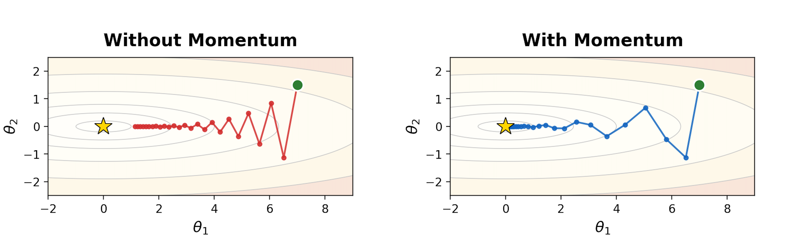

| Method | State | Update Rule | Comment |
|---|---|---|---|
| Vanilla GD | none | $\theta_{t+1}=\theta_t-\alpha \nabla f(\theta_t)$ | Follow the gradient; can zig-zag in narrow valleys. |
| Momentum | $m_t$ for direction | $m_t=\beta m_{t-1}+(1-\beta)\nabla f(\theta_t)$   $\theta_{t+1}=\theta_t-\alpha m_t$ | Build inertia: accelerate consistent directions, damp oscillations. |
| RMSProp | $v_t$ for scale | $v_t=\rho v_{t-1}+(1-\rho)(\nabla f(\theta_t))^{\odot 2}$   $\theta_{t+1}=\theta_t-\alpha\frac{\nabla f(\theta_t)}{\sqrt{v_t}+\epsilon}$ | Per-parameter step size: large recent gradients → smaller steps. |
| Adam | $m_t$ and $v_t$ | $\hat m_t=\frac{m_t}{1-\beta_1^t},\;\hat v_t=\frac{v_t}{1-\beta_2^t}$   $\theta_{t+1}=\theta_t-\alpha\frac{\hat m_t}{\sqrt{\hat v_t}+\epsilon}$ | Direction + normalization, with bias correction. |

## Momentum: building velocity

<figure>
  
  <figcaption>Fig 1. SGD without (left) and with (right) momentum. Illustration produced using Claude Opus 4.6 via Claude Code (Anthropic).</figcaption>
</figure>

### Vanilla gradient descent: reactive, step-by-step

Let's start from the most basic update rule. Suppose we want to minimize an objective $f(\theta)$. **Vanilla gradient descent** updates parameters by moving against the gradient:

$$
\theta_{t+1} = \theta_t - \alpha \nabla f(\theta_t)
$$

where $\alpha$ is the learning rate.

This rule is **fully reactive**: the step at time $t$ depends only on the current gradient. That can work, but it has a well-known failure mode in ill-conditioned landscapes (think "long narrow valleys"):

- Along the steep direction, gradients are large → updates overshoot and flip sign.
- Along the flat direction, gradients are small → progress is slow.
- Net effect: **zig-zagging** and wasted steps (see [Fig 1](#momentum-building-velocity), left half).

A useful mental image: vanilla GD is like a person who looks at the slope under their feet each step and immediately turns to face the steepest downhill direction. In a narrow valley, they keep bouncing between the two sides instead of making steady progress along the valley floor.

### A small idea: don't forget the past

If gradients keep pointing in a roughly consistent direction (even if noisy), we can exploit that by **accumulating** them. Instead of directly using $\nabla f(\theta_t)$ as the step, we maintain a *running direction* that blends history with the present.

This is the core of **momentum**:

- keep a momentum vector $m_t$,
- update it as an exponential moving average of gradients,
- update parameters using that momentum.

### Gradient descent with momentum: add velocity

One common form (often called **heavy-ball momentum** [<a href="#ref-1">1</a>]) is:

$$
m_t = \beta m_{t-1} + \nabla f(\theta_t), \quad \theta_{t+1} = \theta_t - \alpha m_t
$$

where $\beta \in [0,1)$ is the **momentum coefficient** (often $0.9$).

Interpretation:

- $m_t$ is a **smoothed gradient**: it keeps a memory of where gradients have been pointing.
- When gradients are consistent, $m_t$ grows in that direction $\rightarrow$ **accelerates** progress.
- When gradients oscillate (like across a valley wall), the positive/negative contributions partially cancel $\rightarrow$ **damps** zig-zagging.

You can also view this as an exponential moving average (EMA). Unrolling the recursion gives roughly:

$$
m_t \approx \sum_{k=0}^{t} \beta^{\,t-k} \nabla f(\theta_k)
$$

so older gradients are still present, but exponentially down-weighted.

### A concrete 1D toy example (sign flipping vs consistent signal)

Consider a 1D case.

- If gradients are consistent: $\nabla f(\theta_t) = 1$ for many steps,
  then $m_t$ grows toward $\frac{1}{1-\beta}$:

  $$
  \lim_{t \rightarrow \infty} m_t \approx \lim_{t \rightarrow \infty} \sum_{k=0}^t \beta^{t-k} = \lim_{t \rightarrow \infty} \frac{1 - \beta^t}{1 -\beta} = \frac{1}{1-\beta}
  $$

  so the effective step $\alpha m_t$ becomes larger than $\alpha$. You speed up.

- If gradients flip: $\nabla f(\theta_t) = +1, -1, +1, -1, \dots$,
  then $m_t$ stays small because history cancels the present. You stop bouncing so hard.

This is exactly what we want in a narrow valley: don't overreact to the steep direction that keeps flipping sign; instead, keep moving along the direction that stays consistent.

---

## RMSProp: adaptive step sizes

### Why momentum isn't the full story

Momentum fixes a key weakness of vanilla gradient descent: it reduces zig-zagging by smoothing gradients over time and building a *velocity* in consistent directions.

But momentum still uses a **single global learning rate** $\alpha$ for all parameters and all directions. In many objectives, different coordinates can have very different curvature / gradient scales:

- Some parameters consistently see large gradients (steep directions).
- Others see tiny gradients (flat directions).
- With one $\alpha$, you often face a tradeoff:
  - choose $\alpha$ small enough to avoid exploding in steep directions, but then learning is slow in flat directions;
  - or choose $\alpha$ larger for progress in flat directions, but risk instability elsewhere.

This motivates a second idea: **scale the step size per-parameter based on how big recent gradients have been.**

### The core idea: normalize by recent gradient magnitude

RMSProp [<a href="#ref-2">2</a>] maintains a running (exponentially-decayed) average of squared gradients.

Define a second-moment (variance-like) accumulator:

$$
v_t = \rho v_{t-1} + (1-\rho)\, \nabla f(\theta_t)^{\odot 2}
$$

where $\nabla f(\theta_t)^{\odot 2}$<a href="#note-odot">1</a>Note 1$\cdot^{\odot p}$ denotes the element-wise power: $x^{\odot p} := \big(x_1^p,\;x_2^p,\;\ldots,\;x_d^p\big)$. means squaring each component of the gradient, and $\rho \in [0,1)$ is typically close to $1$ (e.g., $0.9$ or $0.99$).

Then update parameters by dividing by the root mean square of recent gradients:

$$
\theta_{t+1} = \theta_t - \alpha \frac{\nabla f(\theta_t)}{\sqrt{v_t} + \epsilon}
$$

where $\epsilon$ is a small constant (e.g., $10^{-8}$) for numerical stability.

### Intuition: "big gradients → smaller steps; small gradients → bigger steps"

Because of the denominator $\sqrt{v_t}$:

- If a coordinate has **large gradients consistently**, $v_t$ becomes large, so the effective step size in that coordinate shrinks.
- If a coordinate has **small gradients consistently**, $v_t$ stays small, so the effective step size becomes relatively larger.

So RMSProp behaves like an automatic, per-parameter learning-rate tuner: it helps stabilize steep directions *without* forcing the whole optimizer to slow down.

### Relationship to AdaGrad

You can view RMSProp as a practical fix to AdaGrad.

- AdaGrad accumulates squared gradients with a running sum, which can make learning rates decay too aggressively over long training.
- RMSProp uses an **exponential moving average** instead of a sum, so it "forgets" old gradients and keeps learning rates from collapsing.

---

## Adam: combining both

At this point we have two complementary ideas:

- **Momentum** smooths gradients over time (keeps a running direction), reducing zig-zagging and helping consistent progress.
- **RMSProp** rescales updates using a running average of squared gradients, giving **per-parameter adaptive step sizes**.

**Adam** (Adaptive Moment Estimation) [<a href="#ref-3">3</a>] combines both by tracking:

- a **first-moment** estimate (EMA of gradients), and
- a **second-moment** estimate (EMA of squared gradients),

then using the ratio to form the update.

### Step 1: Exponential moving averages of the 1st and 2nd moments

First moment (mean of gradients):

$$
m_t = \beta_1 m_{t-1} + (1-\beta_1)\,\nabla f(\theta_t)
$$

Second moment (mean of squared gradients, element-wise):

$$
v_t = \beta_2 v_{t-1} + (1-\beta_2)\,(\nabla f(\theta_t))^{\odot 2}
$$

- $\beta_1$ plays the role of **momentum** (typical: $0.9$).
- $\beta_2$ controls how slowly the second-moment estimate changes (typical: $0.999$).

### Step 2: Apply bias correction

We usually initialize $m_0 = 0$ and $v_0 = 0$. Early in training, these EMAs are **biased toward zero** because they haven't had time to "warm up". Adam corrects this using:

$$
\hat{m}_t = \frac{m_t}{1-\beta_1^t}, \qquad
\hat{v}_t = \frac{v_t}{1-\beta_2^t}
$$

#### How does correction work?

For first momentum $m_t$, recall:

$$
m_t = \beta_1 m_{t-1} + (1-\beta_1)\nabla f(\theta_t), \qquad m_0=0
$$

Unrolling the recursion gives:

$$
m_t = (1-\beta_1)\sum_{i=1}^{t}\beta_1^{\,t-i}\,\nabla f(\theta_i)
$$

If the gradients have approximately constant mean in early steps, $\mathbb{E}[\nabla f(\theta_i)] \approx \mu$, then

$$
\mathbb{E}[m_t]
= (1-\beta_1)\sum_{i=1}^{t}\beta_1^{\,t-i}\mu
= (1-\beta_1^t)\mu
$$

So $m_t$ underestimates the mean by a multiplicative factor $(1-\beta_1^t)$.

Bias correction divides it out:

$$
\hat m_t := \frac{m_t}{1-\beta_1^t}
\quad\Rightarrow\quad
\mathbb{E}[\hat m_t] \approx \mu
$$

The dividing factor $1/(1-\beta_1^t)$ approaches 1 as $t$ grows, so the correction fades out after early steps<a href="#note-blowup">2</a>Note 2This also resolves the "blow-up" worry: when $t$ is small, $m_t$ is <em>also</em> small (because it started at $0$), and the ratio mainly restores the scale of a proper weighted average..

The same logic applies to the second momentum $v_t$:

$$
v_t = \beta_2 v_{t-1} + (1-\beta_2)(\nabla f(\theta_t))^{\odot 2}, \qquad v_0=0
$$

yielding

$$
\mathbb{E}[v_t] \approx (1-\beta_2^t)\,\mathbb{E}\!\left[(\nabla f(\theta_t))^{\odot 2}\right],
\qquad
\hat v_t := \frac{v_t}{1-\beta_2^t}
$$

### Step 3: The Adam update

Finally, Adam updates parameters via:

$$
\theta_{t+1} = \theta_t - \alpha \frac{\hat{m}_t}{\sqrt{\hat{v}_t} + \epsilon}
$$

This mirrors the "RMSProp normalization" idea, but replaces the raw gradient with a momentum-like direction $\hat{m}_t$.

### What each term is doing

- $\hat{m}_t$ is the **smoothed direction** (Momentum): it averages gradients so you don't overreact to noisy mini-batches or oscillations.
- $\sqrt{\hat{v}_t}$ is the **scale normalizer** (RMSProp): it shrinks steps where recent gradients have been large and allows relatively larger steps where gradients have been small.
- Bias correction matters most at the beginning; later, $(1-\beta_1^t)$ and $(1-\beta_2^t)$ approach 1, so the correction fades out.

---

## References

<ul class="references">
<li id="ref-1">[1] B. T. Polyak. <em>Some methods of speeding up the convergence of iteration methods.</em> USSR Computational Mathematics and Mathematical Physics, 4(5):1–17, 1964.</li>
<li id="ref-2">[2] G. Hinton, N. Srivastava, K. Swersky. <em>Neural Networks for Machine Learning — Lecture 6e: rmsprop.</em> Coursera, 2012. (<a href="https://www.cs.toronto.edu/~tijmen/csc321/slides/lecture_slides_lec6.pdf">slides</a>)</li>
<li id="ref-3">[3] D. P. Kingma and J. Ba. <em>Adam: A Method for Stochastic Optimization.</em> ICLR 2015. (<a href="https://arxiv.org/abs/1412.6980">arXiv:1412.6980</a>)</li>
</ul>

## Appendix: steepest descent

This appendix explains a key geometric fact used throughout optimization: At a point $\theta$, the gradient $\nabla f(\theta)$ points in the direction of **steepest increase**<a href="#note-norm">3</a>Note 3The "steepest direction = gradient direction" statement is with respect to the <strong>Euclidean norm</strong>. If you measure step size with a different norm or metric, the "steepest" direction changes. of $f$, and its magnitude gives the **maximum rate of increase**.

### Directional derivative: "how fast does $f$ change if I move this way?"

Take a small step from $\theta$ in some direction $u$ with $\|u\|_2 = 1$: $\theta(\epsilon) = \theta + \epsilon u$. The instantaneous rate of change of $f$ along direction $u$ is the **directional derivative**:

$$
D_u f(\theta) := \left.\frac{d}{d\epsilon} f(\theta+\epsilon u)\right|_{\epsilon=0}
$$

Using a first-order Taylor expansion,

$$
f(\theta+\epsilon u) \approx f(\theta) + \epsilon \nabla f(\theta)^\top u
$$

so

$$
D_u f(\theta) = \nabla f(\theta)^\top u
$$

### Why this is maximized by the gradient

We now ask: among all unit directions $u$, which one makes $D_u f(\theta)$ as large as possible?

This is a simple optimization problem: $\max_{\|u\|_2=1}\; \nabla f(\theta)^\top u$.

By the Cauchy–Schwarz inequality,

$$
\nabla f(\theta)^\top u \le \|\nabla f(\theta)\|_2 \, \|u\|_2 = \|\nabla f(\theta)\|_2
$$

and equality holds when $u$ is aligned with the gradient:

$$
u^\star = \frac{\nabla f(\theta)}{\|\nabla f(\theta)\|_2}
$$

Therefore:

- The **steepest ascent direction** is $u^\star = \frac{\nabla f(\theta)}{\|\nabla f(\theta)\|_2}$.
- The **maximum rate of increase** (over all unit directions) is $\max_{\|u\|_2=1} D_u f(\theta) = \|\nabla f(\theta)\|_2$.

### Why gradient descent uses the negative gradient

If the gradient points toward steepest **increase**, then the direction of steepest **decrease** is simply the opposite: $-\nabla f(\theta)$.

That's why vanilla gradient descent updates parameters as:

$$
\theta_{t+1} = \theta_t - \alpha \nabla f(\theta_t)
$$

### Quick intuition

- $\nabla f(\theta)$ encodes *how sensitive* $f$ is to changes in each coordinate.
- Dotting with a direction $u$ projects that sensitivity onto the direction you plan to move.
- The projection is largest when you move **directly along** the gradient.
