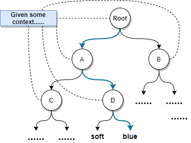

## Introduction

The **softmax** function is widely used in the output layer of neural-network models for classification. In the *binary case*, it reduces to the familiar **sigmoid** mapping.

Given a score (logit) vector $x=(x_1,x_2)$, the softmax probabilities are

$$
P(X=x_1)=\frac{\exp(x_1)}{\exp(x_1)+\exp(x_2)},\quad
P(X=x_2)=\frac{\exp(x_2)}{\exp(x_1)+\exp(x_2)}
$$

In particular,

$$
P(X=x_1)=\sigma(x_1-x_2)
$$

where $\sigma(z)=\frac{1}{1+\exp(-z)}$ is the sigmoid function.

In NLP applications, however, softmax can be expensive because it requires **normalizing over the full vocabulary**. For example, in the Continuous Bag-of-Words (CBOW) model,

$$
P(w\mid c)=\frac{\exp(S(w,c))}{\sum_{v\in V}\exp(S(v,c))}
$$

where $S(w,c)$ is a scoring function. Computing the denominator requires summing over $|V|$ vocabulary items, which is $O(|V|)$ per update in a naïve implementation. To address this, **various approximations and alternatives** to softmax have been proposed.

## Non-Sampling Softmax Variants

These methods avoid sampling-based objectives and keep an exactly normalized probability model.

### Hierarchical Softmax (H-Softmax)

Hierarchical Softmax reduces the cost of computing a normalized distribution by **factorizing** the probability over a hierarchy of **clusters** (typically organized as a tree).

If the clusters are **non-overlapping**, each outcome $Y$ belongs to exactly one cluster $C(Y)$, and we obtain

$$
P(Y \mid X) = P(Y \mid C(Y), X)\,P(C(Y)\mid X)
$$

H-Softmax applies this factorization **recursively** by organizing the vocabulary as a (usually binary) tree. For a **balanced binary tree** over a vocabulary $V$, the path length from root to any leaf is $O(\log |V|)$, so we can compute $P(w\mid c)$ by multiplying probabilities along the path rather than summing over all $|V|$ words.

H-Softmax reduces the *per-example* cost of computing $P(w\mid c)$ during training from $O(|V|)$ to $O(\log |V|)$.

### Differentiated Softmax (D-Softmax)

Differentiated Softmax is motivated by a simple observation: **word frequencies are highly skewed**, and allocating the same embedding/output dimensionality to every word can be wasteful. D-Softmax **assigns different representation sizes to different frequency bands**: frequent words get higher-dimensional vectors, rare words use lower-dimensional vectors.

### Character-level Softmax

Predict **characters (or subword units)** instead of whole words. The model generates a word as a sequence of characters and applies a softmax at each step over a much smaller character set.

## Monte Carlo Softmax Approximations

These approaches use **Monte Carlo sampling** to approximate the *softmax expectation* in the gradient.

### Cross-Entropy Loss with Softmax

For a target word index $i$ with logits $\mathbf{z}$ and predicted distribution $\hat{\mathbf{y}}=\mathrm{softmax}(\mathbf{z})$:

$$
L_i = -z_i + \log\left(\sum_{j=1}^{|V|} \exp(z_j)\right)
$$

### Gradient and the "expectation" form

$$
\nabla L_i = -\nabla z_i + \mathbb{E}_{k\sim \hat{\mathbf{y}}}\!\left[\nabla z_k\right]
$$

The expectation under the model distribution requires summing over all $|V|$ items. Sampling-based methods replace this full sum with a **Monte Carlo estimate**.

### Importance Sampling

Sample from an easier **proposal** $Q$ and reweight:

$$
\mathbb{E}_{X\sim P}[f(X)] = \mathbb{E}_{X\sim Q}\!\left[f(X)\frac{P(X)}{Q(X)}\right]
$$

Self-normalized importance sampling gives a ratio estimator that doesn't require computing $Z$ exactly, but is **biased** in general.

## Noise-Contrastive Estimation (NCE)

NCE reformulates learning as a **binary classification** problem: distinguish data samples from noise samples using the same underlying scoring function.

Let $D$ be a binary label where $D=1$ means $(w,c)$ comes from the **data** distribution $P^+$, and $D=0$ means $w$ comes from a **noise** distribution $P^-$. Using Bayes' rule,

$$
P(D=1\mid w,c)=\frac{P^+(w\mid c)}{P^+(w\mid c)+k\,P^-(w)}
$$

Many implementations **fix** $Z(c)=1$ (often called **self-normalization**), so $P^+(w\mid c)\approx \exp(S(w,c))$.

### Why does NCE work?

As $k\to\infty$ (the noise-to-data ratio grows), $\frac{kP^-}{P^+ + kP^-} \to 1$, and the **negative** NCE gradient approaches the maximum-likelihood gradient:

$$
\nabla_\theta L_c
\to
-\sum_{w\in V}
\left(P^{\mathcal{D}_c}(w) - P^+(w\mid c)\right)
\nabla_\theta \log P^+(w\mid c)
$$

This shares the same stationary points as maximum-likelihood training.

### Negative Sampling

Negative sampling is often presented as a simplified, more practical variant of NCE. With a self-normalized approximation $P^+(w\mid c)\approx \exp(S(w,c))$, uniform noise $P^-(w)=1/|V|$, and $k=|V|$ (so $kP^-(w)=1$):

$$
L = -\sum_{(w,c)\in\mathcal{D}}
\left[
\log \sigma(S(w,c))
+ \sum_{i=1}^{|V|} \log \sigma(-S(w'_i,c))
\right]
$$

This is the familiar **logistic loss** form: push up scores for positive pairs, push down scores for sampled negatives. In practice, negative sampling uses $k\ll |V|$ and a non-uniform noise distribution.

## Tackling the Normalizing Constant Directly

### Self-Normalization

Encourage the model to produce scores such that $Z(c)\approx 1$ by adding a penalty:

$$
L = -\sum_{(w,c)\in \mathcal{D}} \log P(w\mid c)
+ \alpha \sum_{(w,c)\in \mathcal{D}} (\log Z(c))^2
$$

At decoding time we then approximate $P(w\mid c) \approx \exp(S(w,c))$ because the model has been trained to keep $\log Z(c)$ close to $0$.

### Sampling-Based Self-Normalization

Andreas and Klein (2015) [9] apply the penalty only on a sampled subset $\mathcal{D}'\subseteq \mathcal{D}$:

$$
L = -\sum_{(w,c)\in \mathcal{D}} \log P(w\mid c)
+ \frac{\alpha}{\gamma}\sum_{c\in \mathcal{D}'} (\log Z(c))^2
$$

where $\gamma\in(0,1)$ is the sampling rate. This reduces the work spent on explicitly controlling $Z(c)$ during training while still encouraging self-normalization.

## Conclusions

The central challenge addressed by most softmax variants is how to **avoid the expensive computation of the normalizing constant** $Z(c)$ during training and/or inference.

### Acknowledgements

This post follows the high-level ordering of variants from Ruder's post [1], but takes a more **math-oriented** approach. The derivations and proofs presented here were written by me. Special thanks to [Yixuan He](https://sherylhyx.github.io/) for proofreading and helpful feedback.

## References

- [1] Sebastian Ruder. [On word embeddings — Part 2: Approximating the Softmax](https://www.ruder.io/word-embeddings-softmax/), 2016.
- [2] Morin, F. and Yoshua Bengio. "Hierarchical Probabilistic Neural Network Language Model." AISTATS (2005).
- [3] Chen, Grangier, Auli. "Strategies for Training Large Vocabulary Neural Language Models." ACL (2016).
- [4] Bengio and Senecal. "Quick Training of Probabilistic Neural Nets by Importance Sampling." AISTATS (2003).
- [5] Gutmann & Hyvärinen. "Noise-contrastive estimation." AISTATS (2010).
- [6] Mnih, A. and Y. Teh. "A fast and simple algorithm for training neural probabilistic language models." ICML (2012).
- [7] Devlin et al. "Fast and Robust Neural Network Joint Models for Statistical Machine Translation." ACL (2014).
- [8] Goldberger, J. and Oren Melamud. "Self-Normalization Properties of Language Modeling." arXiv:1806.00913 (2018).
- [9] Andreas and Klein. "When and why are log-linear models self-normalizing?" HLT-NAACL (2015).
