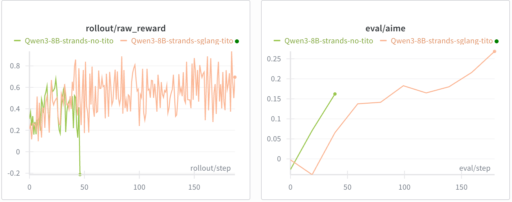
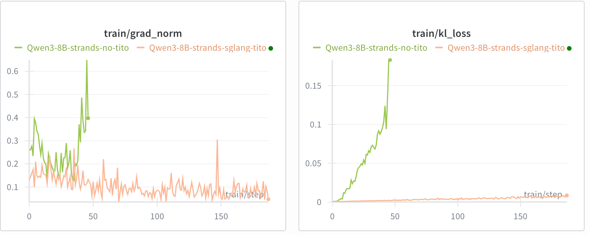

<aside class="post-aside">
<h3>Resources</h3>
<ul>
  <li><a href="https://github.com/strands-rl/strands-sglang">strands-rl/strands-sglang</a></li>
  <li><a href="https://strandsagents.com/docs/community/model-providers/sglang/">Strands · SGLang docs</a></li>
  <li><a href="https://github.com/THUDM/slime/tree/main/examples/strands_sglang">slime · examples</a></li>
</ul>
</aside>

| Component | Agent scaffold / loop | Token-in/token-out |
|---|---|---|
| Strands-Agents | <span class="yes">✓</span> | <span class="no">✗</span> *(text-based)* |
| SGLang | <span class="no">✗</span> | <span class="yes">✓</span> |
| **Strands-SGLang** | <span class="yes">✓</span> | <span class="yes">✓</span> |

<p class="post-lede">Existing agent scaffolds like <em>Strands-Agents</em> [<a href="#ref-1">1</a>] make it easy to serve tool-using agents, but face a key challenge: they operate on <strong>text</strong> (usually an OpenAI-compatible endpoint) while RL training requires exact <strong>token IDs</strong> (token-in, token-out). This mismatch causes <em>retokenization drift</em> [<a href="#ref-2">2</a>] — the tokens used for computing logprobs and gradients no longer match the tokens that were actually generated — leading to effectively off-policy updates and unstable RL training. <strong>Strands-SGLang</strong> bridges this gap by extending Strands-Agents with SGLang's native endpoint [<a href="#ref-3">3</a>] while preserving the customizable agent loop.</p>

## The challenge

Most agent scaffolds provide an agent loop (tool orchestration, iteration control, tracing), but their model interface is typically *text-based*. For RL training, text alone is insufficient: the training pipeline must consume the exact *token-level trajectory* produced by the backend.

If token IDs are reconstructed later by retokenizing the rendered text messages, *retokenization drift* can occur, making updates effectively off-policy and potentially destabilizing RL training.

**Strands-SGLang addresses this by bridging both worlds:**

- <span class="yes">✓</span> **Strands** for the customizable agent scaffold / loop
- <span class="yes">✓</span> **SGLang** native generation for end-to-end token-in/token-out rollouts

So you can keep the same agent loop for serving while producing training-ready trajectories by construction.

<details markdown="1">
<summary>Optional read: Differences between agent serving and training</summary>

Agent *serving* and agent *training* look similar on the surface (both run an agent loop that calls tools and produces answers), but they optimize for different aspects and failure modes.

| Aspect | Agent Servicing (production) | Agent Training (RL / post-training) |
|---|---|---|
| **Response I/O** | Text messages | Token IDs |
| **Tool Parsing** | Lenient (with post-processing fallbacks) | Strict (respects true policy distribution) |
| **Client** | Optimized for reliability + UX | Optimized for high-throughput rollouts |
| **Streaming** | Optional (for UX) | No (reducing client overhead) |

</details>

## The bridge

Strands-SGLang implements a new model class `SGLangModel` backed by SGLang's native `/generate` endpoint, so you can reuse Strands' agent loop while exposing RL-relevant internals:

- **Token-in/token-out rollouts** (token IDs + logprobs/masks): no retokenization drift
- **Strict, on-policy tool-call parsing**: no heuristic repair or post-processing; tool calls are parsed exactly as emitted by the model
- **Native SGLang API**: high-throughput, non-streaming rollouts

<details markdown="1">
<summary><em>Other details</em></summary>

- Iteration limiting hook to cap tool loops cleanly
- Rollout-friendly client defaults aligned with Slime

</details>

## Example

You run a normal Strands agent — but now you can directly read token-level artifacts from the model:

```python
from transformers import AutoTokenizer
from strands import Agent
from strands_tools import calculator
from strands_sglang import SGLangModel

# Suppose Qwen3-8B is served at http://localhost:30000
agent = Agent(
    model=SGLangModel(
        tokenizer=AutoTokenizer.from_pretrained("Qwen/Qwen3-8B"),
        base_url="http://localhost:30000"),
    tools=[calculator],
)
result = await agent.invoke_async("What is (25 * 17)^3 ?")

tm = model.token_manager
print("token_ids:", tm.token_ids)
print("loss_mask:", tm.loss_mask)
print("logprobs:", tm.logprobs)
```

The key insight: the rollout is *already* in the form that RL training wants — no ad-hoc agent loop code required.

## Experiments

We demonstrate the impact of maintaining token-in/token-out (TITO) using a math reasoning agent (with a Python execution tool) with a [Qwen3-8B (thinking)](https://huggingface.co/Qwen/Qwen3-8B) backend.

### Implementations

- TITO implementation: [slime/examples/strands_sglang](https://github.com/THUDM/slime/tree/main/examples/strands_sglang)
- Non-TITO implementation: replacing `SGLangModel` with `OpenAIModel` and applying retokenization

### Results

Without TITO, training collapsed before step 50 despite a similar initial reward increase.





---

## References

<ul class="references">
<li id="ref-1">[1] Strands Agents SDK. <a href="https://github.com/strands-agents/sdk-python">github.com/strands-agents/sdk-python</a></li>
<li id="ref-2">[2] <em>No More Retokenization Drift: Returning Token IDs via the OpenAI Compatible API Matters in Agent RL.</em> <a href="https://blog.vllm.ai/2025/10/22/agent-lightning.html">vLLM blog</a>, 2025.</li>
<li id="ref-3">[3] SGLang documentation. <a href="https://docs.sglang.io/">docs.sglang.io</a></li>
<li id="ref-4">[4] Slime: LLM post-training framework for RL scaling. <a href="https://github.com/THUDM/slime">github.com/THUDM/slime</a></li>
</ul>
